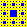

# Square fractals

This simple program is a solution to [this](https://jutge.org/problems/P11007_ca) problem from <jutge.org>. 
The solution is made using the [Pillow](https://pillow.readthedocs.io/en/stable/#) library as well as the [numpy](https://numpy.org/) library for the use of arrays.
As the problem above explains, this program given a background colour,
an alternate colour and a number of iterations $k$ generates a fractal of squares of dimension $(3^k, 3^{k})$ pixels.
An example of this behaviour can be seen as follows:


<table>
<tr>
<th>Input</th>
<th>Output</th>
</tr>
<tr>
<td>

```
black
beige
1
```

</td>
<td>



</td>
</tr>
<tr>
<td>

```
black
beige
1
```

</td>
<td>
</td>
</tr>
</table>

