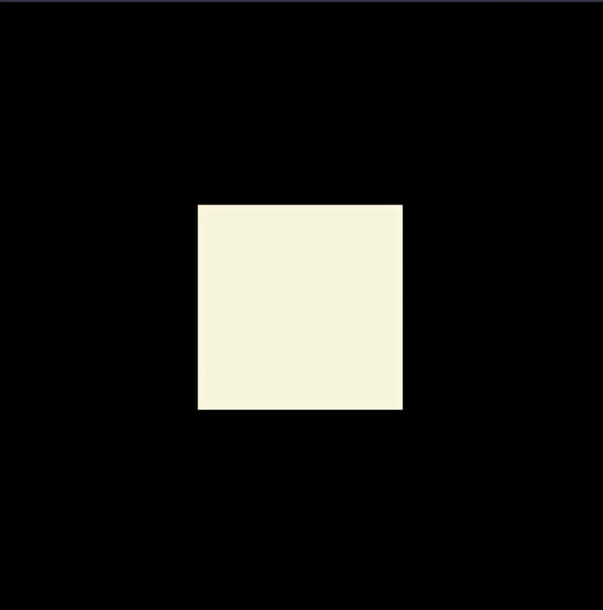

<!-- <style>
.pixelated{
  image-rendering: -moz-crisp-edges;
  image-rendering: -o-crisp-edges;
  image-rendering: -webkit-optimize-contrast;
  image-rendering: optimize-contrast;
  image-rendering: pixelated;
  -ms-interpolation-mode: nearest-neighbor;
}
</style> -->

# Square fractals

This simple program is a solution to [this](https://jutge.org/problems/P11007_ca) problem from [jutge.org](https://jutge.org). 
The solution is made using the [Pillow](https://pillow.readthedocs.io/en/stable/#) library as well as the [numpy](https://numpy.org/) library for the use of arrays.
As the problem above explains, this program given a background colour,
an alternate colour and a number of iterations $k$ generates a fractal of squares of dimension $(3^k, 3^{k})$ pixels. To run this code just execute the python file ```main.py```, write the two prompts and the image will be saved in your current directory as output.png.


An example of this behaviour can be seen as follows:

<center>
<table>
<tr>
<th>Input</th>
<th>Output</th>
</tr>
<tr>
<td>

```
black
beige
1
```

</td>
<td>
<<<<<<< HEAD
<div style=''>
=======
<div style='image-rendering: -moz-crisp-edges;image-rendering: -o-crisp-edges;image-rendering: -webkit-optimize-contrast;image-rendering: optimize-contrast;image-rendering: pixelated;-ms-interpolation-mode: nearest-neighbor;'>
>>>>>>> 114a567119c660e362104346a781c4d435a004b6

</div>
</td>
</tr>
<tr>
<td>

```
red
blue
2
```

</td>
<td>
<div class='pixelated'>

</div>
</td>
</tr>
<tr>
<td>

```
green
purple
3
```

</td>
<td>
<div class='pixelated'>

</div>
</td>
</tr>
<tr>
<td>

```
yellow
blue
4
```

</td>
<td>
<div class='pixelated'>

</div>
</td>
</tr>
<tr>
<td>

```
black
white
5
```

</td>
<td>
<div class='pixelated'>

</div>
</td>
</tr>
</table>
</center>
